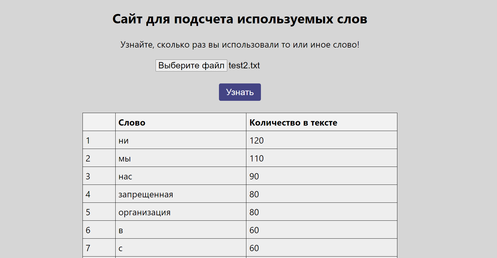

# Simple application to get information about the number of occurrences of words in a text

## A .txt file is submitted for input. At the output, we get a table with the results.

## How to launch a project
```
cd WordNumberCounter
docker-compose up --build
```

Page of site:



## Technologies Used
* Java 17
* Spring Boot 
* React
* Gradle
* Docker
